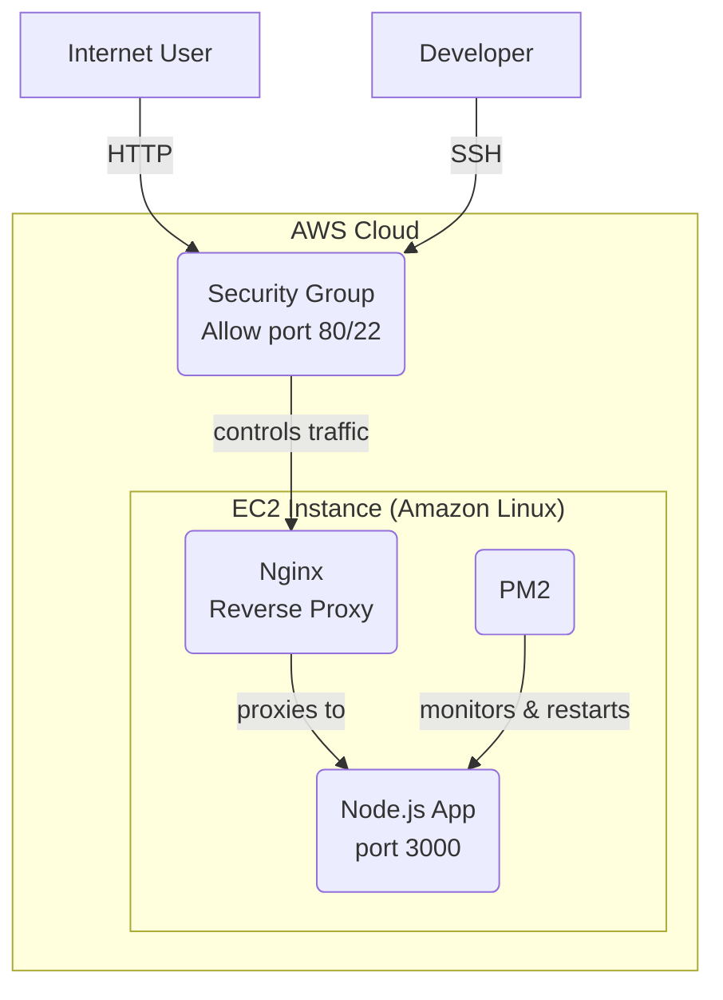

# Real-Time Chat App with AWS EC2 Production Deployment


This project is a hands-on demonstration of deploying a full-stack, real-time application to a production-ready cloud environment on AWS.

The application itself is a simple chat service built with Node.js, Express, and Socket.io. The core focus of this project is the **infrastructure, deployment, and security** required to host a resilient, public-facing web service.

**Live Demo URL:** `http://<your-ec2-public-ip-address>`

---

## 🚀 Production Architecture

This application is deployed on an Amazon Linux 2 EC2 instance using a secure and reliable architecture.

* **AWS EC2:** The core `t2.micro` virtual server hosting the application.
* **Nginx (Reverse Proxy):** Acts as the "front door" for all public traffic. It accepts requests on port 80 and forwards them to the Node.js application (running on port 3000). It is also configured to correctly handle and upgrade the persistent **WebSocket** connections required for Socket.io.
* **PM2 (Process Manager):** A production-grade process manager that keeps the Node.js application alive 24/7. It automatically restarts the app if it crashes and ensures it reboots with the server.
* **AWS Security Groups:** Acts as a virtual firewall, locking down all ports except for port 80 (HTTP) and port 22 (SSH) from a trusted IP.

### Architecture Diagram



---

## 🛠️ Tech Stack

### Application
* **Node.js**
* **Express**
* **Socket.io**
* HTML, CSS, JavaScript (Vanilla JS)

### Infrastructure & Deployment
* **AWS EC2**
* **Nginx** (Reverse Proxy)
* **PM2** (Process Manager)
* **Amazon Linux 2**
* **AWS Security Groups**

---

## ⚙️ Local Development

To run this application on your local machine:

1.  Clone the repository:
    ```bash
    git clone [https://github.com/your-username/your-repo-name.git](https://github.com/your-username/your-repo-name.git)
    ```
2.  Navigate to the project directory:
    ```bash
    cd your-repo-name
    ```
3.  Install dependencies:
    ```bash
    npm install
    ```
4.  Start the server:
    ```bash
    npm start
    ```
    The app will be available at `http://localhost:3000`.

---

## ☁️ Production Deployment (EC2 Summary)

This is a high-level summary of the steps taken to deploy the application to AWS EC2.

1.  **Launch EC2 Instance:** A `t2.micro` instance with Amazon Linux 2 was launched.
2.  **Configure Security Group:** A security group was created to allow inbound traffic on:
    * **Port 22 (SSH)** from a specific IP for secure access.
    * **Port 80 (HTTP)** from anywhere for public web traffic.
3.  **Install Environment:** Connected via SSH and installed `git`, `nvm`, and the LTS version of `Node.js`.
4.  **Deploy Code:** Cloned the project repository from GitHub.
5.  **Install Dependencies:** Ran `npm install` to install Express, Socket.io, etc.
6.  **Run with PM2:** Installed `pm2` globally (`npm install pm2 -g`) and started the app using `pm2 start server.js`. The `pm2 startup` and `pm2 save` commands were used to ensure the app auto-restarts on server reboot.
7.  **Install & Configure Nginx:** Installed Nginx (`sudo amazon-linux-extras install nginx1 -y`) and configured `/etc/nginx/nginx.conf` as a reverse proxy. The configuration routes all traffic from port 80 to `http://localhost:3000` and includes the necessary `Upgrade` headers for WebSocket connections.
